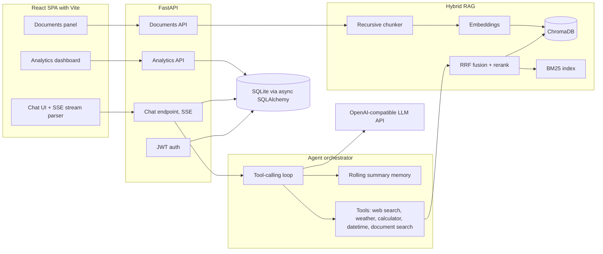

# Synapse

**An agentic AI assistant platform with autonomous tool use, hybrid RAG, and real-time streaming.**


Synapse is a full-stack AI assistant that goes beyond simple chat. A tool-calling agent
decides for itself when to search the web, check the weather, evaluate math precisely, or
retrieve passages from your uploaded documents. Answers stream token by token over SSE,
document answers carry inline citations, and every request is measured for tokens, cost
and latency in a built-in analytics dashboard.

---

## Screenshots

| Agentic tool use in chat | Document Q&A with citations |
|---|---|
|  |  |

| Knowledge base | Usage analytics dashboard |
|---|---|
|  |  |

| Home | Sign in |
|---|---|
|  |  |

---

## Features

**Agentic core**
- Autonomous multi-step tool-calling loop: the model plans, calls tools, reads results and iterates until it can answer
- Five built-in tools: web search (DuckDuckGo, keyless), weather (Open-Meteo, keyless), a sandboxed AST-whitelist calculator, timezone-aware datetime, and private document search
- Tool activity streamed live to the UI as chips, so users watch the agent work

**Retrieval-Augmented Generation done properly**
- Ingestion pipeline for PDF, DOCX, TXT and MD: extraction, recursive chunking with overlap, batched embeddings
- Hybrid retrieval: dense vector search (ChromaDB) plus BM25 keyword search, fused with Reciprocal Rank Fusion
- Optional LLM listwise reranking that fails open to the fused order
- Inline source citations rendered as an expandable panel per answer
- Per-user isolation enforced at both the SQL and vector store layers

**Production engineering**
- Token-by-token streaming over Server-Sent Events, with tool events, usage events and error events in one protocol
- JWT auth with access and refresh tokens, bcrypt password hashing
- Rolling conversation memory: older turns are summarized in the background so long chats keep context without unbounded prompt growth
- Cost observability: per-message token counts, dollar cost and latency, aggregated into a dashboard with daily, per-model and per-tool breakdowns
- Provider abstraction: any OpenAI-compatible API (OpenAI, Groq, Together, local Ollama) works via two environment variables
- Structured JSON logging with request ids, sliding-window rate limiting, strict upload validation
- 44 backend tests with a scripted fake LLM provider, ruff linting, GitHub Actions CI, multi-stage Docker build

---

## Architecture



The full design rationale lives in [docs/ARCHITECTURE.md](docs/ARCHITECTURE.md).

---

## Tech stack

| Layer | Choice | Why |
|---|---|---|
| Backend | FastAPI + async SQLAlchemy 2 | Native async end to end, typed, self-documenting |
| Agent | Hand-rolled orchestrator | Full control over the loop, no framework lock-in |
| Vector store | ChromaDB (persistent) | Local-first HNSW index, with a pure-NumPy fallback |
| Sparse retrieval | rank-bm25 | Classic lexical recall to complement dense vectors |
| LLM | Google Gemini (free tier) by default | Any OpenAI-compatible endpoint works: OpenAI, Groq, Ollama |
| Frontend | React 18 + Vite | Streaming chat UI, markdown rendering, recharts dashboard |
| Auth | PyJWT + bcrypt | Access/refresh token pattern |
| Tests | pytest + httpx + fake provider | Deterministic agent tests without network calls |
| CI/CD | GitHub Actions + Docker | Lint, tests, frontend build and image build on every push |

No LangChain and no agent framework: every part of the agent loop, retrieval pipeline and
streaming protocol is implemented from first principles, which keeps the system small,
debuggable and easy to reason about.

---

## Quickstart

### Prerequisites
- Python 3.11+ and Node 20+
- A free Gemini API key from https://aistudio.google.com/apikey (no card needed).
  Any OpenAI-compatible provider works too; see `.env.example`.

### 1. Clone and configure

```bash
git clone https://github.com/<your-username>/synapse.git
cd synapse
cp .env.example .env
# edit .env: set GEMINI_API_KEY and SECRET_KEY
```

### 2. Run the backend

```bash
cd backend
pip install -r requirements.txt
python -m uvicorn app.main:app --reload --port 8000
```

### 3. Run the frontend (separate terminal)

```bash
cd frontend
npm install
npm run dev
```

Open http://localhost:5173, create an account and start chatting.
Interactive API docs are at http://localhost:8000/api/docs.

### Docker (single container)

```bash
cp .env.example .env   # set GEMINI_API_KEY and SECRET_KEY
docker compose up --build
```

The container builds the frontend, serves it from FastAPI and persists data in a named
volume. Open http://localhost:8000.

---

## Configuration

Everything is set via environment variables (see `.env.example`). Key options:

| Variable | Default | Purpose |
|---|---|---|
| `GEMINI_API_KEY` | (required) | API key; `OPENAI_API_KEY` and `LLM_API_KEY` also accepted |
| `OPENAI_BASE_URL` | Gemini's OpenAI-compatible endpoint | Point at OpenAI/Groq/Ollama for other providers |
| `CHAT_MODEL` | `gemini-3.5-flash` | Default conversation model |
| `UTILITY_MODEL` | `gemini-2.5-flash-lite` | Cheap model for titles, summaries and reranking |
| `AVAILABLE_MODELS` | Gemini 3.5/2.5 flash family | Models offered in the UI picker |
| `VECTOR_STORE` | `chroma` | `chroma` or `memory` (NumPy exact search) |
| `RERANK_ENABLED` | `true` | LLM reranking of fused retrieval results |
| `SECRET_KEY` | (required) | JWT signing secret |

---

## API overview

| Method | Path | Description |
|---|---|---|
| POST | `/api/auth/register` | Create account, returns JWT pair |
| POST | `/api/auth/login` | Login, returns JWT pair |
| POST | `/api/auth/refresh` | Rotate tokens |
| GET | `/api/auth/me` | Current user |
| GET/POST | `/api/sessions` | List / create chat sessions |
| PATCH/DELETE | `/api/sessions/{id}` | Rename / delete a session |
| GET | `/api/sessions/{id}/messages` | Full message history |
| POST | `/api/chat/{id}` | Send a message, streams SSE events |
| GET/POST | `/api/documents` | List / upload knowledge base files |
| DELETE | `/api/documents/{id}` | Remove a document and its chunks |
| GET | `/api/analytics/overview` | Tokens, cost, latency, tools, models |
| GET | `/api/health`, `/api/info` | Health and app metadata |

SSE event types emitted by the chat endpoint:
`token`, `tool_start`, `tool_end`, `citations`, `usage`, `title`, `done`, `error`.

---

## Testing

```bash
cd backend
pip install -r requirements-dev.txt
ruff check app tests
pytest -q
```

The suite covers auth flows, session isolation between users, the streaming protocol,
the agent tool loop (via a scripted fake provider), calculator sandbox safety, the
chunker, RRF fusion math, document ingestion and citation extraction. No test makes a
network call.

---

## Project structure

```
synapse/
├── backend/
│   ├── app/
│   │   ├── agent/          # orchestrator, memory, tool implementations
│   │   ├── api/            # auth, chat (SSE), sessions, documents, analytics
│   │   ├── core/           # security, logging, rate limiting
│   │   ├── llm/            # provider abstraction, OpenAI impl, pricing
│   │   ├── rag/            # extract, split, vector stores, hybrid retriever, ingest
│   │   ├── config.py       # pydantic-settings configuration
│   │   ├── database.py     # async SQLAlchemy engine
│   │   ├── models.py       # ORM models
│   │   ├── schemas.py      # pydantic request/response schemas
│   │   └── main.py         # app factory, middleware, static serving
│   ├── tests/              # 44 tests with a fake LLM provider
│   └── requirements.txt
├── frontend/
│   └── src/
│       ├── components/     # AuthPage, Sidebar, ChatView, MessageBubble,
│       │                   # DocumentsPanel, AnalyticsView
│       ├── lib/api.js      # fetch wrapper, token refresh, SSE parser
│       └── styles/         # design system (dark, glass, gradient accents)
├── .github/workflows/ci.yml
├── Dockerfile              # multi-stage: node build -> python runtime
├── docker-compose.yml
└── docs/ARCHITECTURE.md
```

---

## Roadmap

- WebSocket transport option alongside SSE
- Postgres + pgvector deployment profile
- Voice input and TTS output
- Multi-agent workflows (researcher + writer pattern)
- Evaluation harness for retrieval quality (recall@k on a labeled set)

## License

MIT. See [LICENSE](LICENSE).
