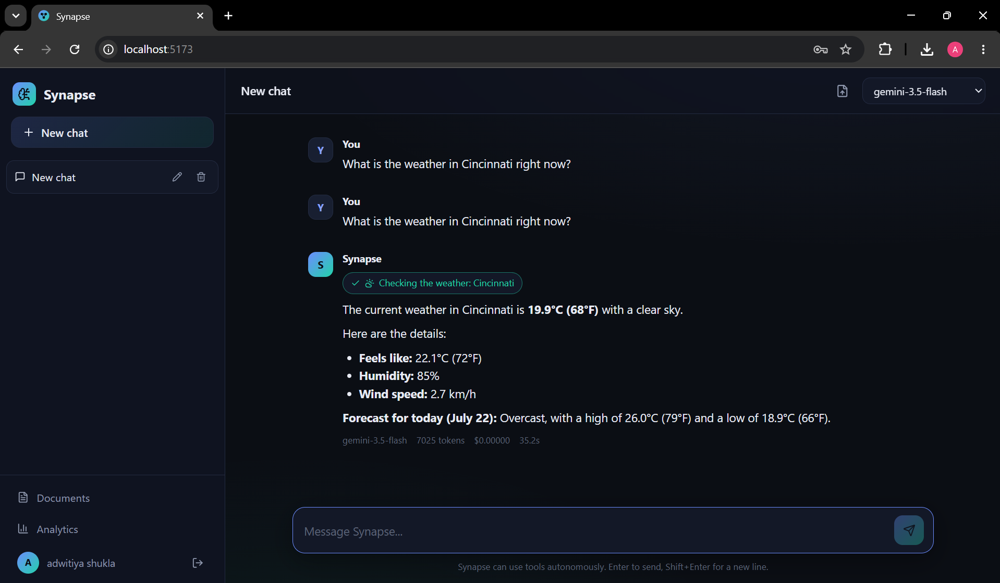
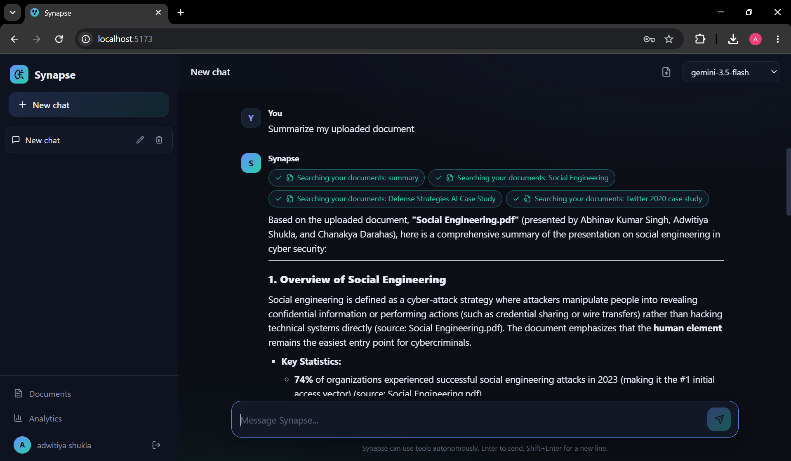
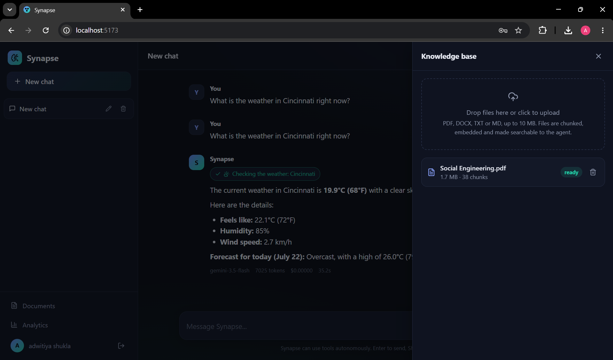
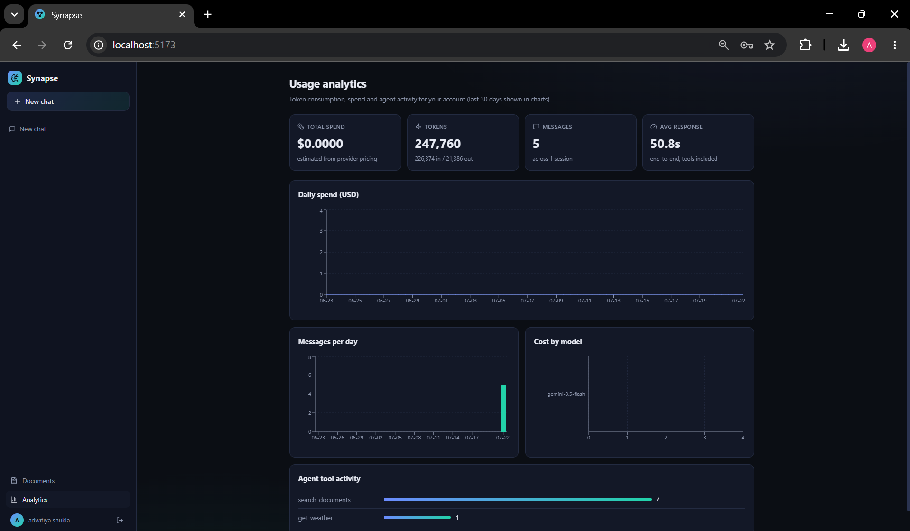
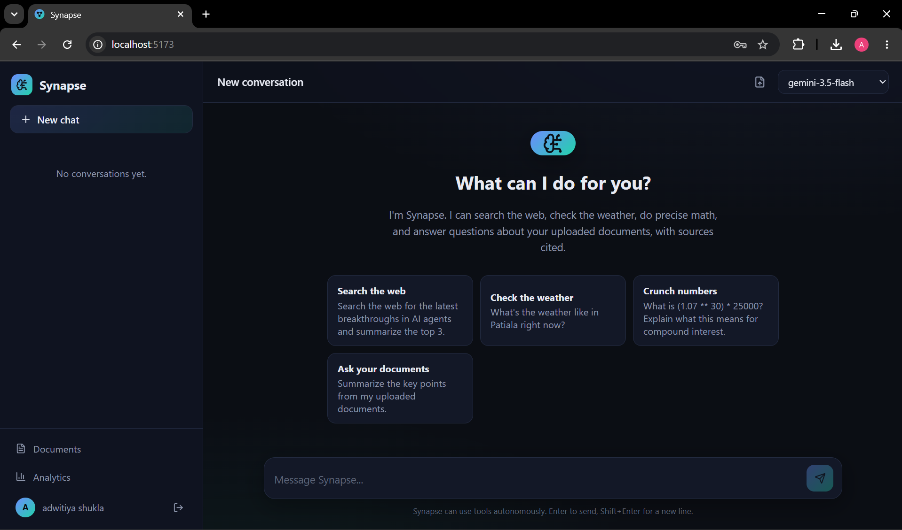
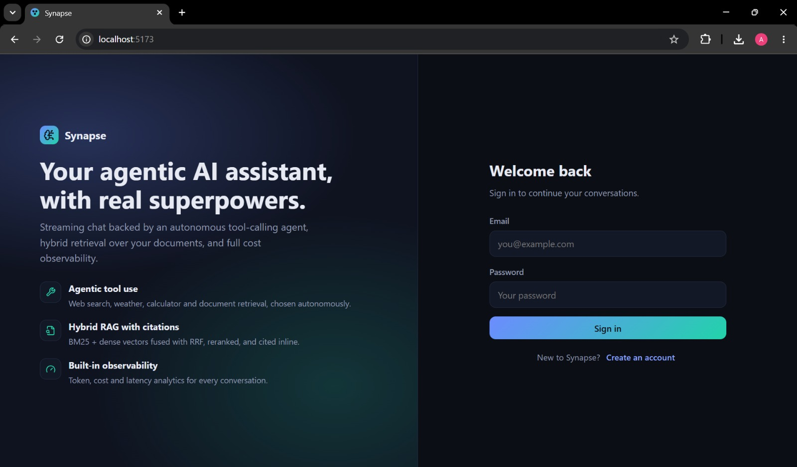
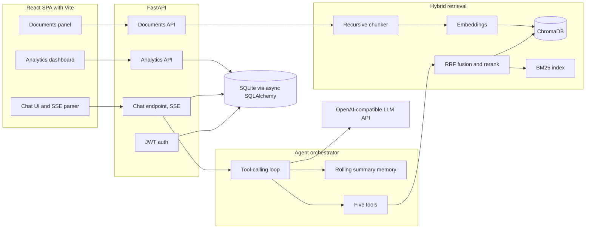

# Synapse

A chat assistant that decides for itself when to search the web, do arithmetic, check the
time or read your uploaded documents, and streams its reasoning while it works.

### [Try the live demo on Hugging Face](https://huggingface.co/spaces/adwitiyashukla/synapse)

One click gives you a guest account with a sample report already indexed. No signup, no
API key.

[](https://huggingface.co/spaces/adwitiyashukla/synapse)


## Why I did not build the obvious version

The obvious version of this project is: embed the user's documents, run cosine similarity
on the question, paste the top five chunks into the prompt. I built that first. It demos
beautifully and it breaks the moment anyone asks a question containing a proper noun, a
product code or an exact figure, because dense embeddings are good at meaning and bad at
literal tokens. Ask about "Northwind" and you get five chunks that are vaguely about
robotics companies.

The second thing I noticed is that pure retrieval turns the assistant into a search box
with extra latency. If someone asks what 1.07 to the power of 30 times 25000 comes to, the
right move is not to retrieve anything, it is to compute it. If they ask about today's
weather, no document in the world helps.

So the actual problem is not retrieval. It is deciding, per question, whether to retrieve
at all. That is what I spent most of the time on, and it is why there is no LangChain here.
I wanted to see the loop that makes that decision, because when it picks wrong I need to be
able to read the code and find out why.

## Screenshots

| Agent choosing a tool | Document answer with citations |
|---|---|
|  |  |

| Knowledge base | Usage analytics |
|---|---|
|  |  |

| Home | Sign in |
|---|---|
|  |  |

## What the agent actually decides

The loop lives in `backend/app/agent/orchestrator.py` and is about 150 lines. Each turn it
builds a prompt from the system persona, a rolling summary, the last 16 messages and the
new question, then advertises the tool schemas and streams the completion. If the model
asks for tools, they run concurrently through `asyncio.gather`, the results are appended to
the conversation, and it loops. A cap of 6 iterations stops it spinning.

There are five tools:

| Tool | Backing service | Why it exists |
|---|---|---|
| `web_search` | DuckDuckGo, no key | Anything after the model's cutoff |
| `get_weather` | Open-Meteo, no key | A question no document can answer |
| `calculator` | AST walk over a whitelist | Language models are bad at arithmetic |
| `get_current_datetime` | zoneinfo | The model has no clock |
| `search_documents` | The hybrid retriever below | The user's own files |

Two details I care about. The document tool is only advertised when the user actually has
indexed documents, so the model is not tempted to reach for an empty knowledge base. And
tools that fail return a JSON error payload rather than raising, so the model reads the
failure and works around it instead of the whole turn dying.

The calculator does not use `eval`. It parses the expression into an AST and walks a strict
whitelist of node types, which is the only way I could convince myself it was safe to
expose to a language model that takes instructions from strangers on the internet.

## The retrieval problem that took real thought

Since dense search misses exact tokens and keyword search misses paraphrases, I run both
and fuse the two ranked lists with Reciprocal Rank Fusion:

```
score(d) = sum over rankers of 1 / (60 + rank(d))
```

RRF only looks at rank position, never at the underlying scores. That matters because a
cosine similarity of 0.82 and a BM25 score of 11.4 are not comparable and any attempt to
normalise them is a fudge factor I would have had to tune and could not defend. Ranks are
comparable by construction.

The pipeline: chunks of 900 characters with 150 of overlap, top 20 from the vector store,
top 20 from BM25, fused down to 10, then optionally reordered by a cheap model acting as a
listwise reranker before the top 5 reach the agent. If the reranker errors or returns
nonsense, it falls back to the fused order rather than failing the query.

One structural decision that paid off later: SQLite is the source of truth for chunk text
and also stores a float32 copy of every embedding, while the vector store holds only
embeddings and ids. That means the BM25 index can always be rebuilt from the database, the
vector store can be swapped between ChromaDB and a NumPy fallback, and deleting a document
is one cascade. It also turned out to be what made the public demo free to run, since a new
guest gets the sample document by copying stored embedding bytes instead of calling the
embedding API.

## How the pieces fit together



I wrote up the reasoning behind each of these choices in more depth in
[docs/ARCHITECTURE.md](docs/ARCHITECTURE.md), including why I used Server-Sent Events
rather than WebSockets and how the two-tier memory keeps prompts from growing without
bound.

## Three things I got wrong

Four things broke badly enough to take real time. These are the three worth reading.

### The reply that only appeared when I refreshed

The first message in a brand new chat produced nothing. The tool chips appeared, so the
agent was clearly running, and then no text. If I refreshed the page, the full answer was
sitting there waiting for me. So the backend was fine and the browser was throwing the
reply away.

The chat view creates a session lazily when you send the first message. The parent
component was keyed on the session id, so the moment that id went from null to a real
value, React saw a different key, unmounted the component and mounted a fresh one. The
reply that was streaming into local state went with it. The database write had already
happened, which is why refreshing showed it.

The fix was removing the key and tracking in a ref that this view created this particular
session, so the history reload skips exactly once. Two lines of change for two hours of
staring at a working backend and an empty screen.

### The tool call that worked once and then returned 400

A single tool call was fine. Any follow-up returned `400: Function call is missing a
thought_signature`.

Gemini attaches an opaque signature to each function call and expects it handed back
verbatim when you replay the conversation on the next iteration. The OpenAI schema I was
normalising everything into has no field for it, so my provider was quietly dropping it
while converting streamed fragments into my own dataclass. Everything worked right up to
the point where the agent needed a second round trip, which is exactly the case the whole
project is about.

The fix was carrying two dictionaries of unrecognised provider fields on the tool call
object and splatting them back when rebuilding the assistant message. It generalises, so
any provider that decorates tool calls with extra keys now survives the round trip.
`test_provider_extra_fields_are_echoed_back` pins it down.

### CI said 50 passed and 2 errors, my laptop said 52 passed

Two numbers that could not both be true, which is usually where the interesting bug is.

CI was failing on `DROP TABLE chunks` with "database is locked". The chat endpoint fired
conversation summarisation with `create_task` so the user would not wait for it. That task
outlived the request and kept a SQLite connection open. On my machine it finished quickly
enough to never collide with anything. On a slower shared runner, the next test's schema
teardown arrived while the connection was still live.

So it was never a test problem. It was a connection leak that only a slower machine was
able to show me. The fix was attaching the work to the response with Starlette's
`BackgroundTask`, which means the framework awaits it and releases the connection instead
of letting it float free, plus disposing the engine in the test fixture. CI has been green
since.

## How I decided it was good enough

Testing an agent is awkward because the interesting behaviour depends on a model you do not
control. My answer was a scripted fake provider: it implements the same three-method
interface as the real one, and each call consumes one pre-written turn, either text or a
list of tool calls. That makes the whole loop deterministic and means no test touches the
network.

```
cd backend
pip install -r requirements-dev.txt
ruff check app tests
pytest -q
```

| File | Tests | What it pins down |
|---|---|---|
| `test_auth.py` | 7 of 7 | Registration, login, token rotation, and that an access token cannot be used as a refresh token |
| `test_chat.py` | 5 of 5 | The SSE event sequence, the tool loop, provider field passthrough, and cross-user session rejection |
| `test_rag.py` | 10 of 10 | Chunk sizing and overlap, RRF ordering, upload and retrieve, per-user isolation |
| `test_tools.py` | 21 of 21 | 9 expressions the calculator must compute, 10 it must refuse, timezone handling |
| `test_demo.py` | 7 of 7 | Guest isolation, rate limits, and that cloning the sample document costs zero API calls |
| `test_sessions.py` | 2 of 2 | Session CRUD and isolation between users |

The calculator rejection cases are the ones I am most pleased with, because writing them
forced me to think like an attacker: `__import__('os').system('ls')`, `open('/etc/passwd')`,
`().__class__.__bases__`, `exec`, a lambda, a list comprehension, and `2 ** 999999` to make
sure a whitelist that blocks imports still cannot be used to hang the process.

What these 52 tests do not tell you is whether retrieval is any good. They check that the
fusion maths is right and that the plumbing works, not that the top 5 chunks are the right
5 chunks. Measuring that needs a labeled set of questions with known correct passages, and
I do not have one, so I am not going to put a recall number in this README that I cannot
back up. It is the most obvious gap in the project and I would rather say so than dress it
up.

## Running it

You need Python 3.12, Node 22, and a free Gemini API key from
https://aistudio.google.com/apikey, which does not ask for a card. Any OpenAI-compatible
endpoint works instead: OpenAI, Groq, or Ollama running locally.

```bash
git clone https://github.com/adwitiyashukla/synapse.git
cd synapse
cp .env.example .env
```

Set `GEMINI_API_KEY` and `SECRET_KEY` in `.env`, then run the backend:

```bash
cd backend
pip install -r requirements.txt
python -m uvicorn app.main:app --reload --port 8000
```

And the frontend in a second terminal:

```bash
cd frontend
npm install
npm run dev
```

Open http://localhost:5173. API docs are at http://localhost:8000/api/docs.

Or skip both and use Docker, which builds the frontend and serves it from FastAPI in one
container on http://localhost:8000:

```bash
docker compose up --build
```

### Configuration worth knowing about

| Variable | Default | Purpose |
|---|---|---|
| `GEMINI_API_KEY` | required | `OPENAI_API_KEY` and `LLM_API_KEY` are also accepted |
| `OPENAI_BASE_URL` | Gemini's OpenAI-compatible endpoint | Change this to switch provider |
| `CHAT_MODEL` | `gemini-3.5-flash` | The conversation model |
| `UTILITY_MODEL` | `gemini-2.5-flash` | Titles, summaries and reranking |
| `VECTOR_STORE` | `chroma` | Or `memory` for exact NumPy search |
| `RERANK_ENABLED` | `true` | Turn off to skip the listwise reranker |
| `SECRET_KEY` | required | JWT signing secret |

### The API

| Method | Path | What it does |
|---|---|---|
| POST | `/api/auth/register`, `/api/auth/login` | Create an account or sign in, returns a token pair |
| POST | `/api/auth/refresh` | Rotate tokens |
| POST | `/api/auth/demo` | Guest account, only when demo mode is on |
| GET | `/api/auth/me` | Current user |
| GET, POST | `/api/sessions` | List or create chat sessions |
| PATCH, DELETE | `/api/sessions/{id}` | Rename or delete a session |
| GET | `/api/sessions/{id}/messages` | Full history |
| POST | `/api/chat/{id}` | Send a message, streams the reply |
| GET, POST | `/api/documents` | List or upload files, 10 MB cap |
| DELETE | `/api/documents/{id}` | Remove a document and its chunks |
| GET | `/api/analytics/overview` | Tokens, cost, latency, tools, models |
| GET | `/api/health`, `/api/info` | Health and app metadata |

The chat endpoint streams eight event types down one connection, which is what lets the UI
show tool chips and citations as they happen rather than waiting for the full reply:

```
token | tool_start | tool_end | citations | usage | title | done | error
```

## What is in the repo

```
synapse/
├── backend/
│   ├── app/
│   │   ├── agent/          the orchestrator loop, rolling memory, the five tools
│   │   ├── api/            auth, chat over SSE, sessions, documents, analytics
│   │   ├── core/           JWT and bcrypt, JSON logging, rate limiting, daily quota
│   │   ├── llm/            provider interface, OpenAI-compatible impl, price table
│   │   ├── rag/            extraction, chunking, vector stores, hybrid retriever
│   │   ├── config.py       one pydantic-settings object, everything env driven
│   │   ├── models.py       ORM models
│   │   └── main.py         app factory, middleware, static file serving
│   ├── demo_assets/        the sample report the public demo indexes
│   └── tests/              52 tests against a scripted fake provider
├── frontend/src/
│   ├── components/         AuthPage, Sidebar, ChatView, MessageBubble,
│   │                       DocumentsPanel, AnalyticsView, DemoBanner
│   ├── lib/api.js          fetch wrapper, token refresh, SSE parser
│   └── styles/             one stylesheet, dark theme
├── deploy/huggingface/     Dockerfile and setup notes for the public Space
├── docs/ARCHITECTURE.md    longer write-up of the design decisions
├── .github/workflows/      CI, and a six-hourly ping that keeps the Space awake
└── Dockerfile              node build stage, then python runtime
```

## The live demo

The Hugging Face Space runs the same code with `DEMO_MODE=true`, which adds a guest
endpoint that creates a throwaway account and copies the seeded knowledge base at the
database layer. A visitor gets working retrieval on their first message without a single
embedding call.

Since the whole thing runs on a free tier, it is capped: 12 messages an hour per visitor,
5 guest sessions an hour per address, and 200 messages a day across everyone. Guest
accounts older than 12 hours are deleted on startup. Space storage is wiped on restart, so
the sample document is re-indexed automatically each time the container boots, and a
scheduled GitHub Action pings it every six hours so it never goes to sleep and makes a
visitor wait for a cold start.

## Stack

| Layer | Choice |
|---|---|
| Backend | FastAPI, async SQLAlchemy 2, SQLite via aiosqlite |
| Agent | Written from scratch, no framework |
| Retrieval | ChromaDB for dense, rank-bm25 for sparse, RRF to fuse |
| Model | Google Gemini free tier, any OpenAI-compatible endpoint works |
| Frontend | React 18, Vite, react-markdown, recharts |
| Auth | PyJWT with 60 minute access and 7 day refresh tokens, bcrypt |
| Tests | pytest, httpx, a scripted fake provider |
| CI | GitHub Actions: ruff, pytest, frontend build, Docker build |

## License

MIT. See [LICENSE](LICENSE).

## Tags

Everything below is actually used somewhere in this repository. Nothing here is listed for
the sake of listing it.

| Area | What I used |
|---|---|
| Languages | Python 3.12, JavaScript ES2020, SQL, HTML, CSS, Bash, YAML |
| Agentic AI | Tool calling, autonomous multi-step agent loop, tool schema design, concurrent tool execution, bounded iteration, graceful tool failure handling, system prompt design |
| RAG and retrieval | Hybrid retrieval, dense vector search, BM25 sparse search, Reciprocal Rank Fusion, LLM listwise reranking, recursive chunking with overlap, batched embeddings, inline citations |
| LLM engineering | Provider abstraction over OpenAI-compatible APIs, streaming completions, incremental tool call assembly, rolling conversation summarisation, token accounting, cost modelling per model |
| Backend | FastAPI, async SQLAlchemy 2, aiosqlite, Pydantic v2, pydantic-settings, Uvicorn, REST API design, dependency injection, background tasks, asyncio concurrency |
| Streaming | Server-Sent Events, typed event protocol, ReadableStream parsing in the browser, backpressure-free token delivery |
| Data | ChromaDB, rank-bm25, NumPy, pypdf, python-docx, float32 embedding storage, cascade deletes |
| Frontend | React 18, Vite, React hooks, custom state management, react-markdown, remark-gfm, recharts, lucide-react, responsive dark theme CSS |
| Auth and security | JWT access and refresh tokens, bcrypt hashing, token type checking, per-user data isolation, AST whitelist sandboxing, sliding window rate limiting, daily quota enforcement, upload validation, secret management |
| Testing | pytest, pytest-asyncio, httpx ASGI transport, parametrized tests, test doubles, deterministic fake LLM provider, ruff linting |
| DevOps | Docker multi-stage builds, Docker Compose, GitHub Actions CI, scheduled workflows, Hugging Face Spaces, container health checks, structured JSON logging, environment driven configuration |
| External APIs | Google Gemini, OpenAI SDK, DuckDuckGo search, Open-Meteo |
