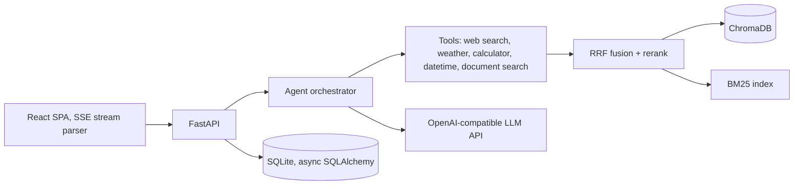

# Synapse

**An agentic AI assistant with autonomous tool use, hybrid retrieval, and full cost observability.**

Click **Launch demo** in the app above. No signup, no API key. You get a private
sandbox preloaded with a sample report so document retrieval works from your
first message.

---

## Try these in the demo

| Prompt | What it demonstrates |
|---|---|
| `What is the weather in Amsterdam right now?` | The agent decides on its own to call a live weather tool, then formats the result |
| `What was Northwind's 2026 revenue and gross margin?` | Hybrid RAG over the preloaded report, with the source cited inline |
| `Summarize the autonomy research section` | Multi-step retrieval: the agent issues several searches before answering |
| `Search the web for recent work on agentic RAG` | Live web search through the tool layer |
| `What is (1.07 ** 30) * 25000?` | Precise arithmetic through a sandboxed calculator, not token prediction |

Then open **Analytics** in the sidebar for per-message token, cost and latency
tracking, and **Documents** to upload a PDF of your own.

---

## What makes it interesting

**The agent loop is hand-written.** No LangChain, no agent framework. About 150
lines of explicit orchestration: stream the model, detect tool calls, execute
them concurrently, feed results back, iterate until the model answers. Owning
the loop means exact control over event ordering, token accounting across
iterations, and graceful degradation when a tool fails.

**Retrieval is hybrid, not just vectors.** Dense embedding search (ChromaDB)
runs alongside BM25 keyword search. Results are combined with Reciprocal Rank
Fusion, then optionally reranked by a small model. Dense-only retrieval misses
exact identifiers; BM25-only misses paraphrases. RRF needs no score
normalization between the two, which makes it robust.

**Streaming is a typed protocol.** One SSE channel carries `token`,
`tool_start`, `tool_end`, `citations`, `usage`, `title`, `done` and `error`
events, so the UI can show tool activity live rather than freezing until the
answer arrives.

**Cost is measured, not guessed.** Exact token usage is captured per request,
accumulated across every iteration of an agent turn, priced from a rate table,
and persisted with latency for the analytics dashboard.

---

## Architecture

Stack: FastAPI, async SQLAlchemy 2, ChromaDB, rank-bm25, PyJWT, React 18, Vite,
Recharts. Model access goes through an OpenAI-compatible provider layer, so
OpenAI, Gemini, Groq or a local Ollama server are a two-variable change. This
Space runs on Gemini's free tier.

---

## Notes on this deployment

- Guest sessions are isolated from each other and cleared periodically.
- Fair-use limits apply (messages per hour per visitor, plus a daily ceiling)
  because the demo runs on one shared free-tier key.
- The Space container has ephemeral storage, so the database resets on restart.
  The sample document is re-seeded automatically on boot.
- For unlimited use, clone the [GitHub repo](https://github.com/adwitiyashukla/synapse)
  and run it locally with your own free Gemini key.

---

Built by [Adwitiya Shukla](https://github.com/adwitiyashukla).
Source, tests and architecture notes: **[github.com/adwitiyashukla/synapse](https://github.com/adwitiyashukla/synapse)**
